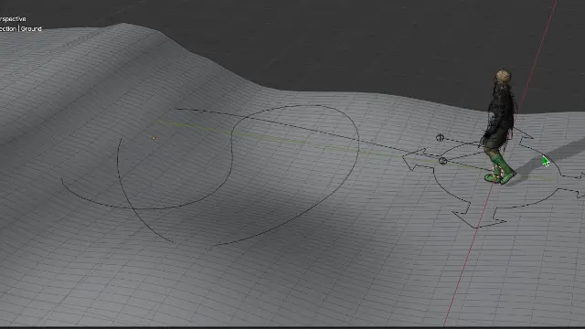

# Foot-Work Blender Add-on

Foot-Work available now at [Gumroad](https://boyleo.gumroad.com/l/footwork)

## Descriptions
Welcome to the **Foot-Work** Blender Addon documentation.  Foot-Work is a set of tools that can help Blender animators work with locomotion

The tools consist of 7 modules

 - **Stride** - Adjust stride distance in a cycle
 - **Offset** - Move character to next location maintaining anchor foot position
 - **Turn** - Add pivot point at the feet to turn the character
 - **Ground** - Snap character to ground object
 - **Root Motion** - Convert between in-place cycle and root motion cycle
 - **Path Finding** - Create curve path to target location avoiding obstacles in the process
 - **Curve** - Let your character travel along curve without foot slide

While sharing some properties, each tool works independently.  
Many of these operations are destructive, meaning they will alter your anim curve directly.  
So **keep your backup**, if you are uncertain about the operation.  

#### source animation
source animation is locomotion cycle.  

#### offset bones
offset ik bones such as feet, torso, and hands to make continueous locomotion.  

#### offset root
offset root bone instead of IK bones.  

#### ground snap
snap armature to ground object.  
Use raycasting to put feet on the ground.  

#### constraint to curve
move character along curve preserving stride distance

### path finding
[path finding (video on youtube)](https://youtu.be/0mRixdbk4ZA)

## Prerequisite 
 - **Blender** - Foot-Work Addon was developed in Blender 4.2.3 LTS.  
   Due to some API changes from previous version, It's probably not working correctly in previous version.  
   In newer version, it should work. If you encounter any problem, please let me know.
 
 - **Rig** - the addon only works with any armature that is animated with IK bones.  
   The armature should have Root Bone, Torso Bone, optional IK Feet and Toes.  
   A walk cycle with only FK Bones does not work. If you have animated with FK bones, try to convert it IK bones first.
   
 - ~~**Bones Axis** - Currently the IK bones' axis should be consistent. Take Rigify for example,
   where -Y points forward and Z points upward, these are consistent from root to torso and feet.
   Some rig has different orientation between these bones. Foot-Work **cannot** work in this situation.~~ The issue has been addressed in v1.2.0
  
 - **Animation** - Foot-Work Addon is **NOT** a walk cycle generator.  
   You should have your walk cycle animation ready before using this addon.
 
 - **NLA** - The addon does not work with NLA. Locomotion cycle should be baked onto current action first. 

## Installation
The Foot-Work Addon is available to purchase [here](https://boyleo.gumroad.com/l/footwork)

The installation process is straight forward.  
Just open the Addon preference in Blender and install the ZIP file to preferred location

When Enable, Press N in 3D-View to bring up properties panel,  
then you can find the tools in **Animation** tab

## [Usage](documents/usage.md)
