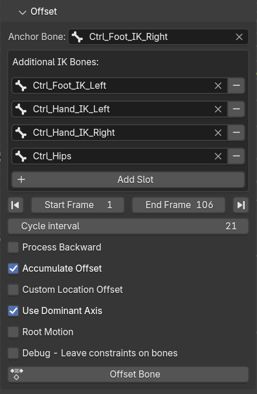
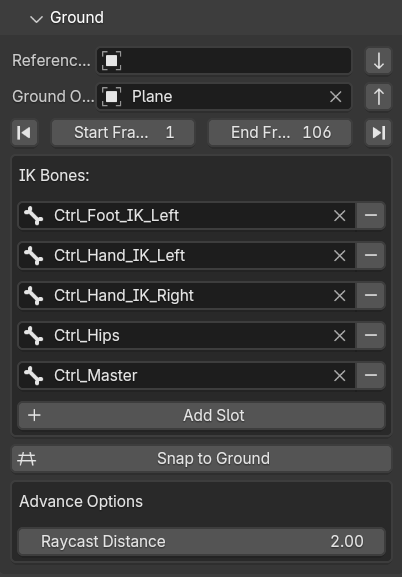
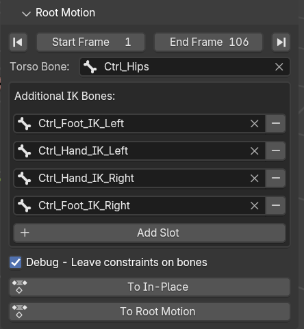

# Foot-Work Blender Add-on Usage
Find the Foot-Work add-on in Animation tab in property panel (N panel)  
The first thing you see is the armature selection. Select the appropriate rig before continue.

Foot-Work tools are not dependent on each other, but certain operations are destructive, and may need to be done orderly to get correct result. For example, you cannot apply ground snapping or turning before offsetting the rig, because it will mess up the offset calculation.

## Stride
Stride tool will adjust the distance of a walk cycle

* Anchor bone. This bone will be used to calculate the distance the walk cycle can travel in one loop.

* Addition bones are other IK bones that needed to move the whole aramture. Click + to add the selected bone to the list. If you want to remove one from the list, You should browse for it and click -

* Stride distance is the final distance you want it to be. If Use percentage is not activate, this value represent the actual distance in Blender unit. Otherwise, you can specify percentage of original distance here.

* Start-End frame determine the frames which you want to adjust.

* Cycle interval is the number of frames in one loop.

When all option is satisfied, you can click Apply Stride to adjust distance.

## Offset
This tool is for offsetting the rig at specific frame while maintaining anchor bone location.

There's a lot of options here.
The first section is the same as Stride.

For the Start Frame, it's usually the first frame of the second loop. If you specify the first fame of the first loop, there would be no prior frame to calculate offset from, thus the offset will be 0.

* Process Backward will calculate offset from the End Frame back to Start Frame

* Accumulate Offset will recalculate offset once a new loop begins, making continuous motion through many loops.

* Apply Rotation will calculate the rotation of the anchor bone. It's generally not applicable for walk cycle, but could help fix incontinuity of some bones.

* Custom Location Offset - When checked,this option bypass the offset calculation and shows the custom offset input in X, Y and Z axis. This is useful when you want to move the rig elsewhere.

* Include Z Axis will offset the Z axis as well. Generally not a good idea to enable this for walk cycle as there maybe slight difference in height between start and end frame, this option will make the rig move up or down from ground plane.

* Use Dominant Axis will offset only one axis that dominates the movement. This option is useful for walk cycle, as the direction of movement will not change.

* Root Motion, when enabled, will show a root bone selection box. This option will offset the root bone instead of other IK bones in the rig.

The button Offset Bone or Offset Root will change its label according to the current mode of operation.

## Turn
This tool is not actually turning your charactor, but rather, it will add a Pivot Empty at certain location and add constraints to IK bones so that you can rotate the rig with the Empty.

* To work with this tool, you should specify the desired bones. These bones are used to for location where the Pivot Empty will be created.

You don't need to specify the one that you don't need.

* Scrub to the frame you want to start turning, then add turning pivot at desired location by clicking the one of the four buttons.

A Pivot Empty will be created and keyframed at the current frame. All Pivots will be organized in a collection.

* Scrub to the frame when turning is complete, rotate the Pivot, which in turn rotates the rig, and add keyframe to the Empty.

Now your character will turn at specific frame.

Please Note that this tool leaves constraints on your rig, so it best to work your way from first step toward the last sequencially.

When you are done, you can bake the pose and delete the Pivot Collection.

## Ground
This tool will snap the character to the ground object.

There are 2 boxes to select objects. The Reference Object is the 'current ground' of the character. When this box is empty, it assumes a zero plane.

The Ground Object is the ground you want to snap the character to. When this box is empty, it also assumes a zero plane.

When your locomotion cycle is on zero plane, you can just specify the ground object, frames and and each IK bones, then click Snap to Ground.

When you want to change the ground object, change to Refference object to the current ground object, and put the new ground object in Ground Object box. or just leave it empty, to bring the character back to zero plane.

There's one Advance option called Raycast Distance. This is the starting point of the raycast in  global Z axis to find ground object below this point. Must be higher than ground object height or the raycast will fail to find the ground.

## Root Motion
This tool will convert locomotion between In-Place and Root Motion.

The options are straight forward. You can convert from In-Place to Root Motion by clicking the buttons, and vice versa.

But it cannot automatically determine which mode the rig is currently in. So you need to pick the button wisely. 

In a single cycle, if the root bone need to be moved to make the character moving forward, it's in In-Place mode. If the root bone is static while the character is moving forward, then it's in Root Motion mode.

This tool can convert modes back and forth without any issues.

## Curve
This tool will let your character travel along curve without (or minimal) foot slide. It will calculate stride distance and map the character to the curve base on this distance. So your character can walk with different speed and it will move along the curve accordingly, even if there are forward and backward motions in the sequence.

**Curve type should be 2D**, to avoid character 'twisting' around the curve.

To use this tool, the locomotion animation must be In-Place mode, as this tool will only add constraint to root bone and adjust speed based on stride distance.

Please note that the curve's **first control point should be exactly at root bone location** to avoid unexpected result.

The options are self explanatory. Once you click Constraint to Curve, it will add a constraint to root bone. 

If you want to revert the operation, **go back to the first frame** before removing the constraint from root bone. Open the Dope Sheet you will see that one location channel of the root bone has been deactivated, just activate it to get back the straight locomotion.

If you are satisfied with the result, you can bake pose into current action to make it permanent.
