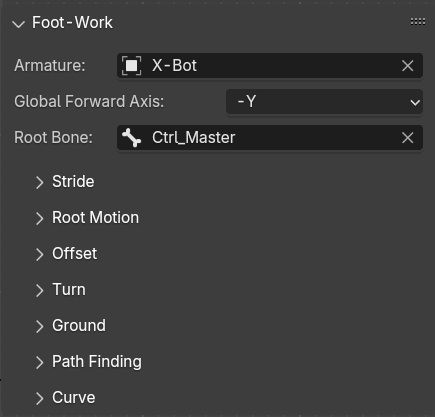
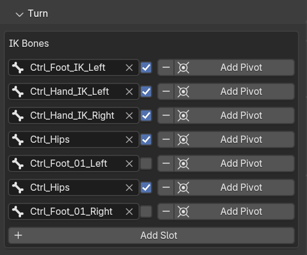
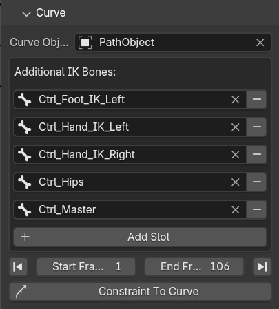

# Foot-Work Blender Add-on Usage

>updated for v1.2.0

Find the Foot-Work add-on in Animation tab in property panel (N panel)  
The first thing you see is the armature selection. Select your character rig and the other two options will appear, allowing you to set forward axis and root bone.

The Global Forward Axis is the global axis which your character is facing.  
In this example the character is facing -Y

>Foot-Work tools are not dependent on each other, but certain operations are destructive, and may need to be done orderly to get correct result. For example, you cannot apply ground snapping or turning before offsetting the rig, because it will mess up the offset calculation.

## Stride
Stride tool will adjust the distance of a walk cycle

* Anchor bone. This bone will be used to calculate the distance the walk cycle can travel in one loop.

* Addition bones are other IK bones that needed to move the whole armature. Click **'+ Add Slot'** to add more slot to the list, and select any IK bones. The list is shared between footwork tools.

    >There might be times when you have duplicates in the list, the script does its best to just ignore the duplicates. For example, in this sceenshot above, you can see The right foot bone is specified in both anchor bone and addition bones, this should not raise any error, though. But in some cases, you might encounter problems, so be sure to check them to avoid unexpected result.

* Stride distance is the final distance you want it to be. If Use percentage is not activate, this value represent the actual distance in Blender unit. Otherwise, you can specify percentage of original distance here.

* Start-End frame determine the frames which you want to adjust.
    
    The small buttons on the left and right are for using the first and the last frame of the current action, not the current timeline range.

* Cycle interval is the number of frames in one loop.

    If you don't want to count frames, you can enter (first frame of the second loop - first frame of  the first loop). for example : 30-1

* Calculate Current Stride Distance will fill in the **Stride Distance** box with current value, giving you percentage to adjust it.

When all option is satisfied, you can click Apply Stride to adjust distance.

## Root Motion
This tool will convert locomotion mode between In-Place and Root Motion.

In a single cycle, if the torso appears to be static relative to root,  
the root bone need to be moved in order to make the character moving forward, it's in In-Place mode.  

If the root bone is static, and the torso making the character move forward, then it's in Root Motion mode. This mode is often used in modern games to avoid foot sliding.

The options are straight forward. You can convert from In-Place to Root Motion by clicking the buttons, and vice versa.

But Foot-Work cannot automatically determine which mode the rig is currently in. So you need to pick the button wisely. 

This tool can convert modes back and forth without any issues.

## Offset
This tool is for offseting the rig at specific frame while maintaining anchor bone location.  
Making your character appears to be moving forward.  

There's a lot of options here.
The first section is the same as Stride.

For the Start Frame, it's usually the first frame of the second loop. If you specify the first fame of the first loop, there would be no prior frame to calculate offset from, thus the offset will be 0.

* Process Backward will calculate offset from the End Frame back to Start Frame

* Accumulate Offset will recalculate offset once a new loop begins, making continuous motion through many loops.  
The new loop is determined by **Cycle Interval** value, so make sure it is correct or you will get weird result.

* Custom Location Offset - When checked,this option bypass the offset calculation and shows the custom offset input in X, Y and Z axis. This is useful when you want to move the rig elsewhere.

* Use Dominant Axis will offset only one axis that dominates the movement. This option is useful for walk cycle, as the direction of movement will not change.

* Include Z Axis will only available when Dominant Axis is not enabled. This option allows offseting the Z axis as well. Generally not a good idea to enable this for walk cycle as there maybe slight difference in height between start and end frame, this option will make the rig move up or down from ground plane.

* Root Motion, This option will offset the root bone instead of other IK bones in the rig.

The button Offset Bone or Offset Root will change its label according to the current mode of operation.  

## Turn
This tool is not actually turning your charactor, but rather, it will add a Pivot Empty at certain location and add constraints to IK bones so that you can rotate the rig with the Empty.

* To work with this tool, you should specify the desired bones. These bones are used to for location where the Pivot Empty will be created.

    The little checkbox for each bone determines if this bone is needed to move the character, If it's not the required bone, you should uncheck it.

 

* Scrub to the frame you want to start turning, then add turning pivot at desired bone location.

A Pivot Empty will be created and keyframed at the current frame. All Pivots will be organized in a collection.

* Scrub to the frame when turning is complete, rotate the Pivot, which in turn rotates the rig, and add keyframe to the Empty.

Now your character will turn at specific frames.

Please Note that this tool leaves bone constraints on your rig, so it best to work your way from first step toward the last sequencially.

When you are done, you can bake the pose, delete the Pivot Collection, and delete the redundant keyframes on  the rig.

## Ground
This tool will snap the character onto ground object.

There are 2 boxes to select objects. The Reference Object is the 'current ground' of the character. When this box is empty, it assumes a zero plane.

The Ground Object is the ground you want to snap the character to. When this box is empty, it also assumes a zero plane.

The little arrow buttons are for quickly swapping these two boxes.

When your locomotion cycle is on zero plane, you can just specify the ground object, frames and and each IK bones, then click Snap to Ground.

When you want to change the ground object, change to Reference object to the current ground object, and put the new ground object in Ground Object box. or just leave it empty, to bring the character back to zero plane.

There's one Advance option called Raycast Distance. This is the starting point of the raycast in global Z axis to find ground object below this point. Must be higher than ground object height or the raycast will fail to find the ground.

## Path Finding
The path finding tool use A* path finding algorithm to find shortest path between 2 locations, and create a curve for your character to follow. It will use the root bone as starting location.  

    If you encounter error about context is incorrect, you should make sure the armature is the active object.

It is good idea to work from top view. as this tool is finding 2D path, not accounting for height.

* Go back to frame 1, or the begining of the locomotion before clicking Start. this button will add an empty at the exact location of the root bone.

* Add other helper objects such as goal, obstacles, and boundary.

* Move the goal to the final location

* Duplicate and rearrange obstacles as you pleased. You can adjust size of obstacle empty, but do not scale it.

* You may add Waypoint to make a detour. Waypoints created will be numbered. you should not duplicate them.

* scale the boundary to barely cover the whole area you want your character to move.

* Grid resolution will subdivide the boundary space by this value, to get the grid to calculate obstacle avoidance. lower value will be faster to calculate but may miss some smaller obstacles.

* Smooth Iteration and Simplify Factor will determine the smoothness of resulting curve

* Show debug grid will create a grid for debugging purpose.  this grid has no other use and can be deleted safely.

    When you click Create Path, the Path Length will tell you how far your character should move in the forward axis for it to move to the end of the path. you should add or remove cycles or adjust stride distance to match this value, so that the character can travel the whole length of the path.

* Adjust Stride will adjust Stride parameters to match the path length. You should make the cycle repeat so that total distance is closest to the calculated path length then use this button to adjust the minor differences.

    >You need to manually click the Apply Stride in Stride tool after this.

The path finding tool does not constraint your character to the path, it merely create the shortest curve path.

Obstacles and Waypoints will be in their own collection, when your done with creating path, you can safely delete the collections, the start and goal objects.

## Curve
This tool will let your character travel along curve without (or minimal) foot slide. It will calculate stride distance and keyframe the offset on the curve for the character to move at correct speed.

**Curve type should be 2D**, to avoid character 'twisting' around the curve.

To use this tool, the locomotion animation should be In-Place mode.

Please note that the curve's **first control point should be exactly at root bone location** to avoid unexpected result. If you use the path finding tool to create the curve, this issue should be correctly handled.

The options are self explanatory. Once you click Constraint to Curve, it will add a constraint to root bone. 

>This operation is destructive, the other tools will not function correctly after you applying curve. So save first and **keep your backup** if you are unsure.

